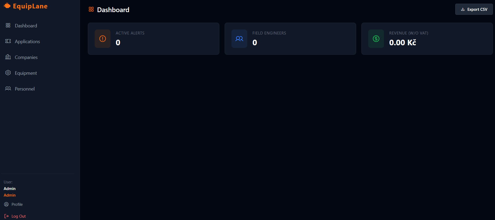
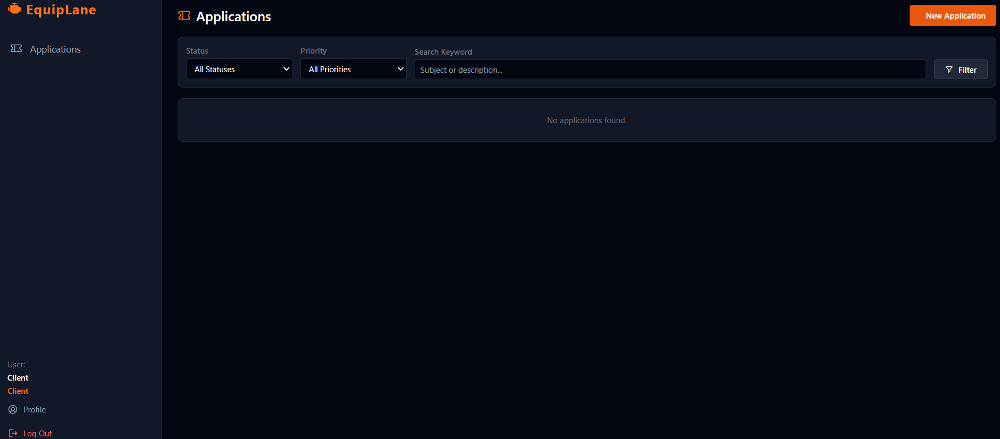
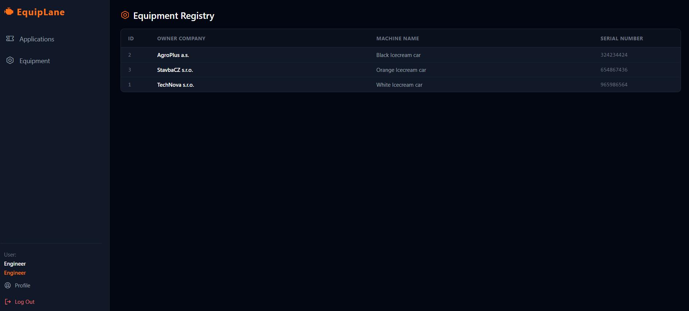
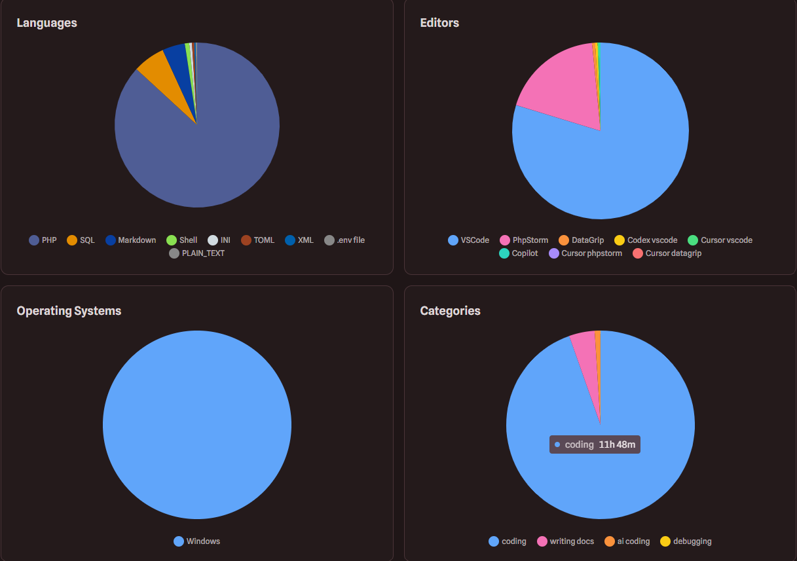
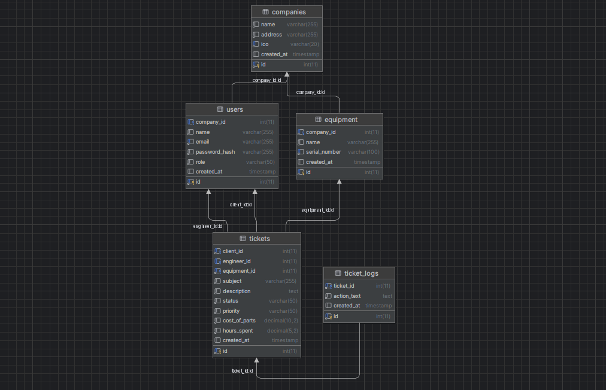

<h1 align="center">EquipLane</h1>

<p align="center">
  
  
  
  
  
  
  
  
 
</p>
**EquipLane** is an industrial maintenance ticketing system built for manufacturing companies, field engineers, and
service administrators.

The platform allows corporate clients to report equipment failures, engineers to manage assigned repair tasks, and
administrators to oversee the full maintenance workflow: from registering companies and machinery to assigning engineers
and calculating service costs.

This is my first major portfolio project. I deliberately built it with **native PHP without using a full-stack framework
** in order to better understand the core mechanics of backend web development: routing, session management, MVC-like
structure, database relations, authentication, authorization, form handling, and application security.

---

## Table of Contents

- [Features](#features)
- [Screenshots](#screenshots)
- [Database Schema](#database-schema)
- [Technical Highlights](#technical-highlights)
- [Tech Stack](#tech-stack)
- [Project Structure](#project-structure)
- [Local Setup](#local-setup)
- [Demo Accounts](#demo-accounts)
- [Development Statistics](#development-statistics)
- [What I Learned](#what-i-learned)
- [Future Improvements](#future-improvements)
- [License](#license)

---

## Features

EquipLane uses **Role-Based Access Control (RBAC)** with three different user roles.

### Client

Clients can:

- View only the equipment that belongs to their own company
- Create repair tickets for broken or malfunctioning machinery
- Set ticket priority
- Track the status of their submitted tickets
- Access their user profile
- Change their account password

### Engineer

Engineers can:

- View tickets assigned to them
- Start repair work on assigned applications
- Request backup if a problem is too complex
- Resolve assigned tickets
- Log the number of hours spent on a repair
- Add the cost of replacement parts used during the repair
- View equipment information connected to maintenance requests

### Administrator

Administrators have full access to the system and can:

- View all repair applications
- Filter tickets by status, priority, and search keywords
- Register and manage corporate clients
- Register and manage equipment
- Manage personnel records
- Assign engineers to tickets
- Monitor the full maintenance workflow
- Access financial data related to completed service tasks

The financial dashboard calculates service revenue based on:

- Engineer hourly rates
- Hours logged on completed tasks
- Replacement parts used during repairs

---

## Screenshots

### Administrator Panel

The administrator can view all applications, filter tickets by status and priority, see assigned engineers, and manage
the maintenance workflow.



### Client Interface

The client can view their profile, access only their own company’s data, and manage their maintenance requests.



### Engineer Interface

The engineer can view assigned work, access equipment data, and manage repair-related tasks.



### Development Activity

The project was tracked with WakaTime. The statistics show tracked development time, main languages, editors, operating
system, and work categories.



---

## Database Schema

The database is built around companies, users, equipment, tickets and ticket logs.



---

## Technical Highlights

Because this project was built without a framework, several standard backend mechanisms were implemented manually.

### Security

- SQL Injection prevention using **PDO Prepared Statements**
- Cross-Site Scripting prevention by escaping user output
- Custom **CSRF token generation and validation** for POST forms
- Session-based authentication
- Role-based authorization
- Protected routes based on user roles
- Password update functionality with server-side validation

### Form Handling

- Implemented the **Post-Redirect-Get** pattern to prevent duplicate form submissions after page refresh
- Used session-based **flash messages** for success and error feedback
- Implemented sticky forms so users do not lose entered data after validation errors
- Added server-side validation for user input

### Database and Performance

- Designed a relational database structure for users, companies, equipment, tickets, assignments, and service costs
- Used PDO for database communication
- Added SQL-level pagination for ticket lists
- Created a database seeder for demo users, companies, equipment, and tickets

---

## Tech Stack

- **Backend:** PHP 8.2
- **Database:** MariaDB / MySQL
- **Database Access:** PDO
- **Frontend:** HTML5, Tailwind CSS, Phosphor Icons
- **Architecture:** Custom procedural MVC-like structure
- **Environment:** Windows
- **Development Tools:** VS Code, PhpStorm, DataGrip

---

## Project Structure

```text
EquipLane/
├── .github/
│   └── workflows/
├── app/
│   ├── auth/
│   │   ├── check.php
│   │   └── csrf.php
│   ├── database/
│   │   ├── db.php
│   │   └── seed.php
│   ├── bootstrap.php
│   └── helpers.php
├── docs/
│   ├── admin.png
│   ├── client.png
│   ├── engineer.png
│   ├── ERDdiagram.png
│   └── stats.png
├── public/
│   ├── companies.php
│   ├── create_ticket.php
│   ├── equipment.php
│   ├── export.php
│   ├── index.php
│   ├── login.php
│   ├── logout.php
│   ├── profile.php
│   ├── tickets.php
│   ├── users.php
│   └── view_ticket.php
├── views/
│   ├── footer.php
│   └── header.php
├── database.sql
├── Dockerfile
├── docker-compose.yml
├── LICENSE
├── ROADMAP.md
└── README.md
```

---

## Local Setup

To run this project locally, you need PHP and MariaDB/MySQL installed.

You can use XAMPP, MAMP, Laragon, Docker, or a custom local environment.

### 1. Clone the repository

```bash
git clone https://github.com/qqxzew/equiplane.git
cd equiplane
```

### 2. Start with Docker

```bash
docker compose up --build
```

Then open the application in your browser:

```text
http://localhost:8000
```

### 3. Manual setup

Create a new MySQL/MariaDB database:

```sql
CREATE DATABASE equiplane;
```

Import the `database.sql` file into the database:

```bash
mysql -u root -p equiplane < database.sql
```

Start the development server from the project root:

```bash
php -S localhost:8000 -t public
```

Then open:

```text
http://localhost:8000
```

### 4. Seed the database

Run the database seeder to populate the application with demo users, companies, equipment, and tickets:

```bash
php app/database/seed.php
```

---

## Demo Accounts

Demo accounts are generated by the database seeder.

| Role          | Email                 | Password   |
|---------------|-----------------------|------------|
| Administrator | `admin@gmail.com`     | `admin`    |
| Client        | `client@gmail.com`    | `client`   |
| Engineer      | `engineer@gmail.com`  | `engineer` |
| Engineer      | `engineer1@gmail.com` | `engineer` |

---

## Development Statistics

Development activity was tracked with WakaTime.

- **Tracked time:** 12h 29m
- **Active days:** 11 days
- **Main language:** PHP
- **Operating system:** Windows
- **Files tracked:** 37 total

### Most Active Files

- `public/view_ticket.php` — 2h 29m
- `public/tickets.php` — 1h 29m
- `public/index.php` — 57m
- `database/seed.php` — 57m

> The tracked time reflects only the activity recorded by the tracking tool. It does not necessarily include all
> planning, debugging, manual testing, research, and documentation work.

---

## What I Learned

While building EquipLane, I focused on understanding how backend applications work without relying on a full-stack
framework.

This project helped me practice:

- Designing a relational database for a realistic business workflow
- Building a custom MVC-like project structure
- Implementing authentication manually
- Implementing role-based authorization
- Protecting forms with CSRF tokens
- Preventing SQL Injection with prepared statements
- Escaping output to reduce XSS risks
- Handling form validation and user feedback
- Using the Post-Redirect-Get pattern
- Creating seed data for testing
- Building a multi-role application with real business logic

The main goal of the project was not only to build CRUD pages, but to create a more realistic workflow with different
user roles, permissions, ticket statuses, assignments, and service cost calculations.

---

## Future Improvements

Possible improvements for future versions:

- Add automated tests
- Add email notifications when ticket status changes
- Add file uploads for equipment photos or repair documentation
- Add audit logs for administrator actions
- Add advanced search and filtering
- Add export of financial reports
- Improve responsive design for mobile devices
- Replace CDN-based Tailwind CSS with a production build pipeline
- Add a public live demo deployment

---

## License

This project is released under the MIT License.
